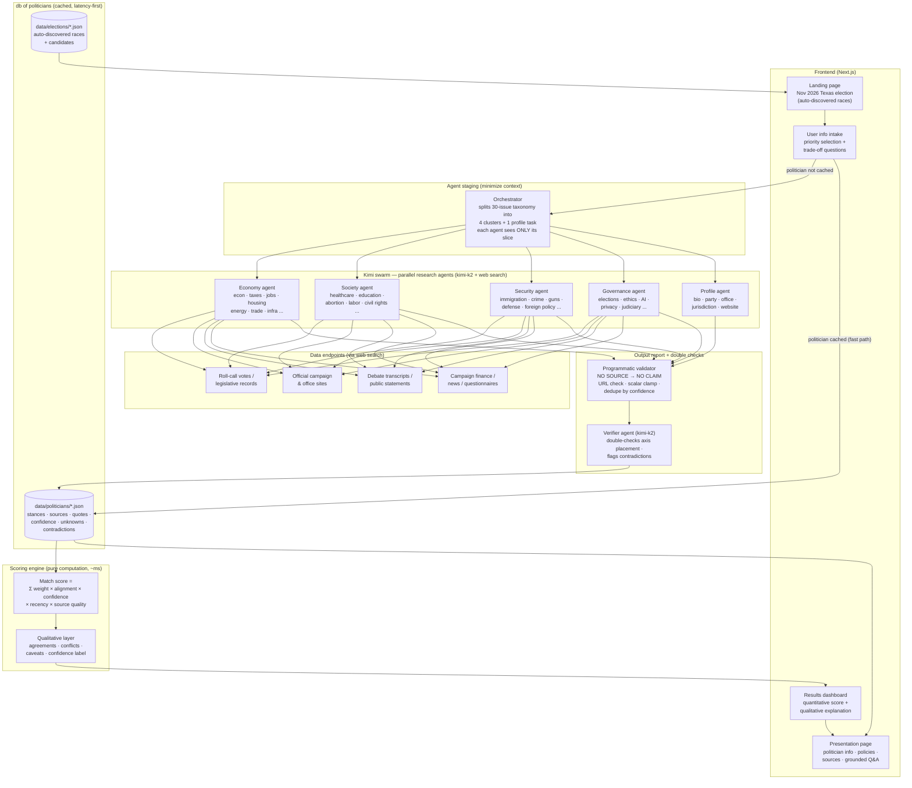
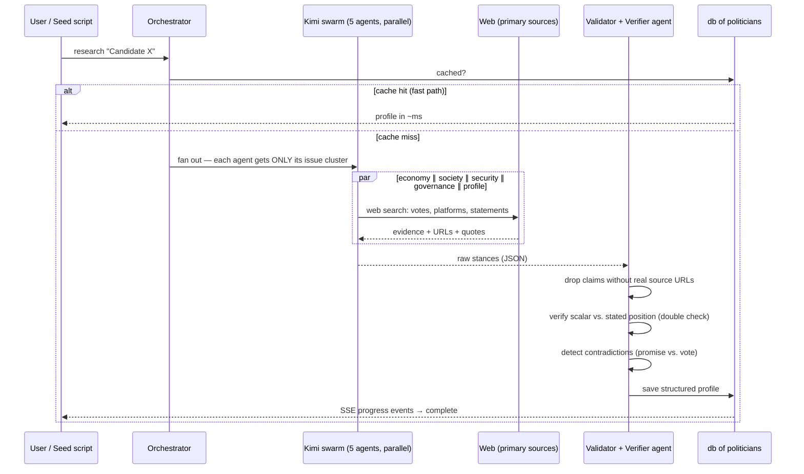

# Civic Match

**A neutral, source-grounded candidate alignment engine.**

Tell it what you care about. It compares your stated priorities against candidates'
voting records, platforms, and public statements — researched live by a **Kimi agent
swarm** — and returns an explainable alignment score, a qualitative explanation,
and a source for every single claim.

> Do not optimize for persuasion. Optimize for informed, source-backed comparison.

---

## System architecture



## Research pipeline (per candidate)



## Scoring: quantitative + qualitative

Every match returns **both**:

| Layer | What it is | How |
|---|---|---|
| Quantitative | `score` 0–100 + per-issue point decomposition | `Σ(weight × alignment × evidence_confidence × recency × source_quality)`, normalized to max achievable |
| Confidence | High / Medium / Low, shown separately from alignment | how much of the user's weighted priorities are covered by real evidence |
| Qualitative | short neutral explanation: top agreements, top conflicts, main caveat, missing evidence | generated from the scored breakdown, grounded only in indexed sources |

Key rules (from the PRD):

- **No source, no claim** — the validator drops any stance without a verifiable URL.
- **Unknowns are first-class** — missing evidence lowers *confidence*, never inflates *alignment*.
- **Conflicts are always shown** — "strongest match" still lists where you disagree.
- **Facts vs. inference are labeled** — the Q&A layer answers only from the indexed evidence base.

## The 30-issue taxonomy

User intake uses **trade-off questions**, not "do you care about X":
each of the 30 issues (economy, inflation, taxes, … judicial appointments) defines a
shared scalar axis (0.0 ↔ 1.0). The user's answer and the candidate's evidenced
position land on the *same axis*, so alignment is a simple, auditable distance.

## Latency-first design

1. **Pre-warm everything**: `npm run seed` auto-discovers the November Texas
   election, then swarm-researches every candidate into the JSON DB.
2. **Cache hit = no LLM call**: match scoring is pure arithmetic over cached
   profiles (<5 ms). The swarm only runs for uncached politicians.
3. **Parallel fan-out**: 5 agents per candidate, 2 candidates concurrently;
   each agent gets a minimal context slice (its cluster only).
4. **SSE streaming**: live research progress streams to the UI so users see
   agents working instead of a spinner.

## Running it

```bash
cp ../.env.example .env.local   # set OPENROUTER_API_KEY
npm install

# Pre-warm: auto-query the November election (Texas first) + research all candidates
npm run seed

npm run dev                     # http://localhost:3000
```

Other states: `npm run seed:state -- virginia`

## API

| Route | Method | Purpose |
|---|---|---|
| `/api/election?state=texas` | GET | cached races (fast path) |
| `/api/election` | POST | force live discovery agent |
| `/api/research` | POST | SSE stream: run the Kimi swarm for one politician |
| `/api/politicians` | GET | list cached profiles |
| `/api/match` | POST | score prefs vs. cached profiles (pure computation) |
| `/api/qa` | POST | grounded Q&A — answers only from indexed evidence |

## Models

| Role | Model | Why |
|---|---|---|
| Research agents (×4 clusters + profile) | `moonshotai/kimi-k2-0905:online` | web search, long context, cheap parallel fan-out |
| Verifier / output agent | `moonshotai/kimi-k2-0905` | fast double-check, no search needed |
| Grounded Q&A | `moonshotai/kimi-k2-0905` | answers restricted to evidence base |

Override with `RESEARCH_MODEL` / `FAST_MODEL` env vars.

## Trust & safety posture

- Neutral language everywhere; the product never says "vote for X".
- User preferences are explicit and local — never inferred, never sold.
- Judicial races and voting logistics deliberately out of scope for generation;
  logistics should link to official election authorities only.
- Every scored claim opens a source drawer: URL, publisher, date, quote,
  primary vs. secondary, and why it was classified that way.
