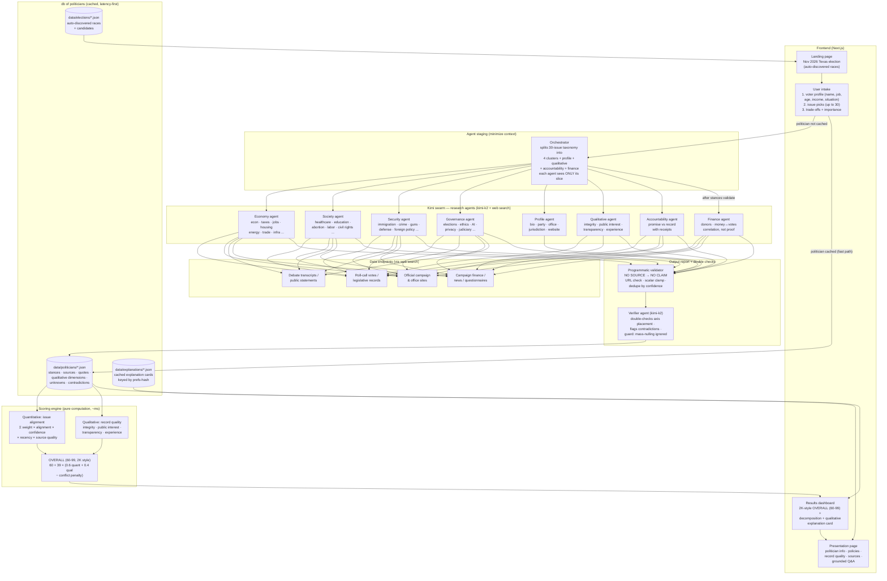
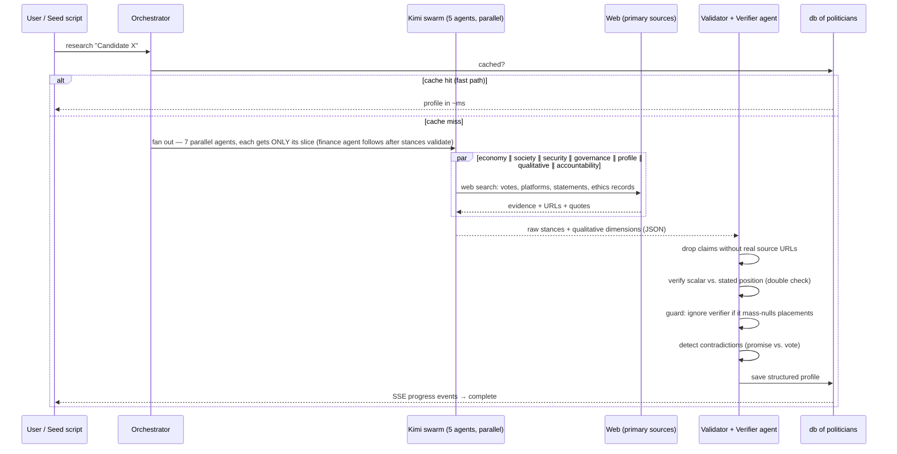

# Civic Match

**A neutral candidate alignment engine built on ground truth.**

**Ground truth is the product.** Every claim on the site — every stance, score,
scorecard verdict, and scenario — traces to a verifiable source: roll-call votes,
official filings, primary documents. The pipeline enforces it mechanically:
**no source, no claim.** Where ground truth doesn't exist, the UI says "unknown"
instead of guessing.

Tell it what you care about. It compares your stated priorities against candidates'
voting records, platforms, and public statements — researched live by a **Kimi agent
swarm** — and returns an explainable alignment score, a qualitative explanation,
and a source for every single claim.

> Do not optimize for persuasion. Optimize for informed comparison grounded in ground truth.

---

## System architecture



## Research pipeline (per candidate)



## Scoring: quantitative + qualitative + OVERALL

Every match returns **three layers**, all decomposable:

| Layer | What it is | How |
|---|---|---|
| Quantitative | issue alignment 0–100 on the user's weighted priorities (taxes, economy, housing, …) | `Σ(weight × alignment × evidence_confidence × recency × source_quality)`, normalized to max achievable |
| Qualitative | record quality, independent of the user's positions: integrity/ethics, public interest, transparency, experience | researched by the qualitative agent with sources; confidence-weighted composite |
| **Overall** | **2K-style rating, 60 = worst, 99 = best** | `60 + 39 × (0.6 × quant + 0.4 × qual − conflict_penalty)`; penalty caps at 0.15 for conflicts on the user's highest-weight issues |
| Confidence | High / Medium / Low, always shown separately from alignment | share of the user's weighted priorities covered by real evidence |

Key rules (from the PRD):

- **No source, no claim** — the validator drops any stance without a verifiable URL.
- **Unknowns are first-class** — missing evidence lowers *confidence*, never inflates *alignment*.
- **Conflicts are always shown** — "strongest match" still lists where you disagree.
- **Facts vs. inference are labeled** — the Q&A layer answers only from the indexed evidence base.

## The 30-issue taxonomy + voter profile

User intake has three steps:

1. **Voter profile (optional, local-only)** — name, occupation, age bracket,
   income bracket, situation flags (homeowner/renter, kids in public school,
   veteran, small business, student, health coverage). Used ONLY to explain what
   positions mean for the user's stated situation — never inferred, never sold,
   never used for demographic persuasion.
2. **Issue picks** — any number (min 3) of the 30 issues, ordered by priority.
3. **Trade-offs + importance** — each picked issue gets a trade-off question
   (not "do you care?") plus an importance level (somewhat ×0.6, very ×1.0,
   deal-breaker ×1.5) that multiplies the rank weight.

Each issue defines a shared scalar axis (0.0 ↔ 1.0). The user's answer and the
candidate's evidenced position land on the *same axis*, so alignment is a
simple, auditable distance.

## Latency-first design

1. **Pre-warm everything**: `npm run seed` auto-discovers the November Texas
   election, then swarm-researches every candidate into the JSON DB.
2. **Cache hit = no LLM call**: match scoring is pure arithmetic over cached
   profiles (<5 ms). The swarm only runs for uncached politicians.
3. **Parallel fan-out**: 5 agents per candidate, 2 candidates concurrently;
   each agent gets a minimal context slice (its cluster only).
4. **SSE streaming**: live research progress streams to the UI so users see
   agents working instead of a spinner.

## Running it

```bash
cp ../.env.example .env.local   # set OPENROUTER_API_KEY
npm install

# Pre-warm: auto-query the November election (Texas first) + research all candidates
npm run seed

npm run dev                     # http://localhost:3000
```

Other states: `npm run seed:state -- virginia`

Maintenance scripts:

- `npx tsx scripts/backfill-qual.ts` — add qualitative dimensions to profiles researched before that agent existed
- `npx tsx scripts/repair.ts` — re-derive null axis placements from indexed evidence + normalize display names to ballot names
- `npm run seed:graph` — scenario trees per race + cross-level connection agents → knowledge graph
- `npx tsx scripts/seed-stakes.ts` — sourced margin/turnout stakes per race
- `npx tsx scripts/backfill-promises.ts` / `backfill-finance.ts` — promise-vs-record scorecards and follow-the-money data

## API

| Route | Method | Purpose |
|---|---|---|
| `/api/config` | GET | issues taxonomy + all UI content from the file DB (nothing hardcoded) |
| `/api/election?state=texas` | GET | cached races (fast path) |
| `/api/election` | POST | force live discovery agent |
| `/api/research` | POST | SSE stream: run the Kimi swarm for one politician |
| `/api/politicians` | GET | list cached profiles |
| `/api/match` | POST | score prefs vs. cached profiles → quant + qual + OVERALL (pure computation) |
| `/api/explain` | POST | qualitative explanation card, personalized to the stated voter profile, cached by prefs-hash |
| `/api/qa` | POST | grounded Q&A — answers only from indexed evidence (positions + record quality) |
| `/api/ballot` | GET | address → your actual races (FastAPI backend resolver, statewide fallback) |
| `/api/scenario` | GET | down-the-line future-possibilities tree per race |
| `/api/graph` | GET | cross-level knowledge graph (municipal ↔ state ↔ federal) |
| `/api/stakes` | GET | sourced margins/turnout/"decided anyway" facts per race |
| `/api/motivate` | POST | personalized nonpartisan hook → info → CTA card |
| `/api/debate` | POST | SSE: record-grounded candidate-agent debate + fidelity judge |
| `/api/voter-insights` | POST | bridge to the FastAPI data backend's precomputed per-race insights |

## Models

| Role | Model | Why |
|---|---|---|
| Research agents (×4 clusters + profile + qualitative) | `moonshotai/kimi-k2-0905:online` | web search, long context, cheap parallel fan-out |
| Verifier / output agent, explanations, Q&A | `moonshotai/kimi-k2-0905` | fast double-check + generation, no search needed |

Override with `RESEARCH_MODEL` / `FAST_MODEL` env vars.

## Trust & safety posture

- Neutral language everywhere; the product never says "vote for X".
- User preferences are explicit and local — never inferred, never sold.
- Judicial races and voting logistics deliberately out of scope for generation;
  logistics should link to official election authorities only.
- Every scored claim opens a source drawer: URL, publisher, date, quote,
  primary vs. secondary, and why it was classified that way.
